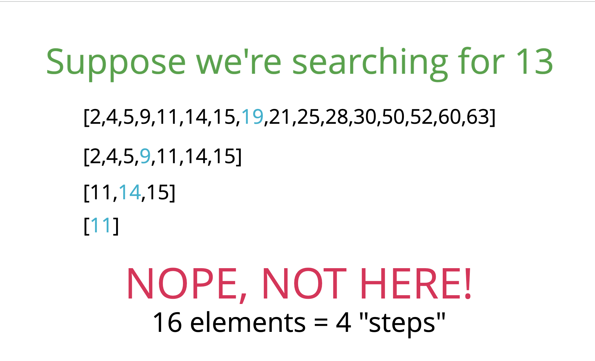
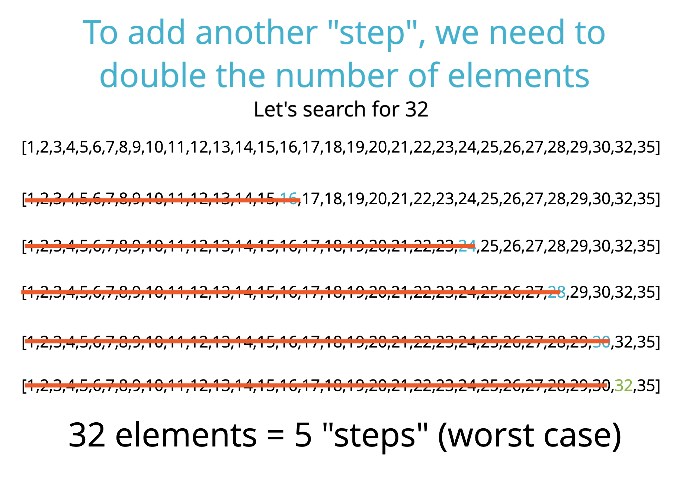

## 검색 알고리즘은 언제 쓰일까? 
문자열이 있는데 해당 문자열에 포함된 다른 문자열이 있는지 확인을 하는 경우, 아니면 웹사이트에 사람들이 가입을 하고 사용자명을 추가할 수 있게 해서, 사람들이 사용자명과 비밀번호를 입력하고 회원가입을 하는 경우.
~~~
var usernames = ["tommy", "monkey", "dinesh123", "q"]

username.indexOf("tommy") //0
username.indexOf("tommy123") //-1 
~~~

## 1. Leaner Search (선형 검색)
세트 간격으로 이동하면서 한 번에 하나의 항목을 확인하는 식으로 모든 항목을 확인한다는 것.
     <i>Are you "tommy"? No ...Yes</i>  
이렇게 해당 값을 찾거나 맨 끝에 도달할 때까지 계속 확인 하는 것을 선형 검색이라고 함.    선형검색에 해당하는 메소드:
   - indexOf
   - includes
   - find
   - findIndex
   
예시 문제: 
This function accepts an array and a value
Loop through the array and check if the current array element is equal to the value  
If it is, return the index at which the element is found 
If the value is never found, return -1

~~~
function linearSearch(arr, val){
    for(var i = 0; i< arr.length; i++) {
        if (arr[i] === val) return i;
    }
    return -1;
}

console.log(linearSearch([34, 56, 1, 2], 1)); //2
console.log(linearSearch([34, 56, 1, 2], 0)); //-1

~~~

#### Linear Search BIG O: O(n)

---

## 2. Binary Search (이진검색)
이진 검색에서는 확인을 할 때마다 남은 항목의 절반을 없앨 수 있음. But 이진 검색은 분류된 배열을 대상으로만 작동하므로 데이터가 분류되어 있어야 함. 숫자를 가장 작은 수-가장 큰 수나  가장 큰 수-가장 낮은 수 순서로 분류하고, 문자열을 알파벳 순서대로 분류를 하는 등, 순서가 있어야 함 

- Binary Search 예시: array에서 15를 찾는 과정

- 예시 문제: 
  <u>Binary Search Pseudocode</u> 
  - This function accepts a sorted array and a value
  - Create a left pointer at the start of the array, and a right pointer at the end of the array
  - While the left pointer comes before the right pointer:
    - Create a pointer in the middle 
    - If you find the value you want, return the index
    - If the value is too small, move the left pointer up
    - If the value is too large, move the right pointer down
  - If you never find the value, return -1

~~~

function binarySearch(arr, elem) {
    var start = 0;
    var end = arr.length -1;
    var middle = Math.floor((start + end) / 2);
    console.log(start, middle, end);

    while(arr[middle] !== elem && start <= end) {
        if(elem < arr[middle]){
            end = middle - 1;
        } else {
            start = middle + 1;
        }
        middle = Math.floor((start + end) / 2);
    }
    if(arr[middle] === elem){
        return middle;
    }
    return -1;
}

console.log(binarySearch([2,5,6,9,13,15,28,30],50))
~~~

#### Linear Search BIG O: O(log n)

