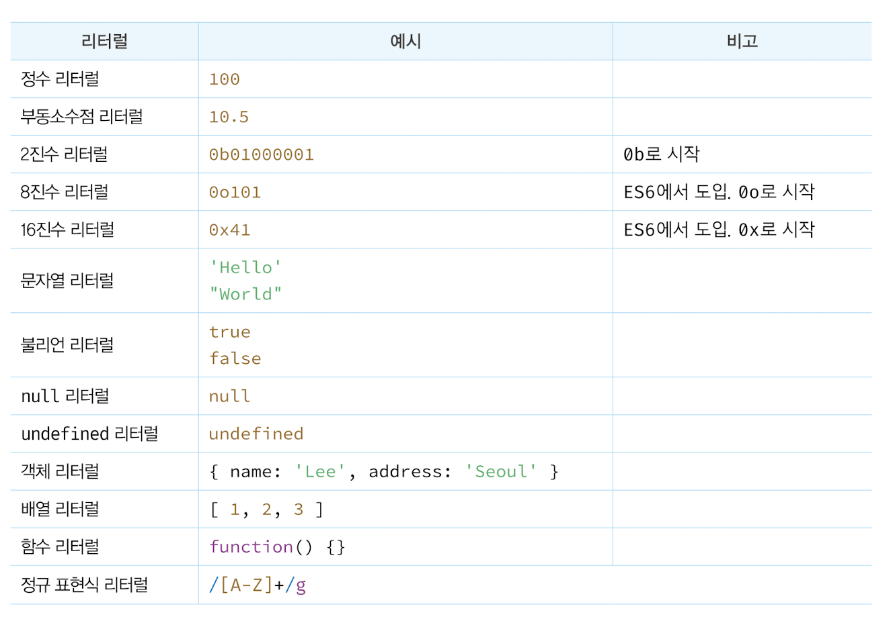

## 5.1 값
- `값(value)` : 표현식(expression)이 평가(evaluate)되어 생성된 결과를 말함.
변수는 하나의 값을 저장하기 위해 확보한 메모리 공간이므로, 변수에 할당되는 것은 <b>값</b>이다. 

~~~
// 변수에는 10 + 20이 평가되어 생성된 숫자 값 30이 할당된다.
var sum = 10 + 20;
~~~

---

## 5.2 리터럴

- `리터럴(Literal)` : 사람이 이해할 수 있는 무자 또는 약속된 기호를 사용해 값을 생성하는 표기법(notation). 자바스크립트 엔진은 코드가 실행되는 시험인 런타임에 리터럴을 평가해 값을 생성. 

### 리터럴 사용하면 다음과 같은 data type의 값을 생성


---

## 5.3 표현식
- `표현식(expression)` : 값으로 평가될 수 있는 문(statement)이다. 즉, 표현식이 평가되면 새로운 값을 생성하거나 기존 값을 참조함.
  - 표현식은 리터럴, 식별자(변수, 함수 등의 이름), 연산자, 함수 호출 등의 조합.
  - 값으로 평가될 수 있는 문은 모두 표현식
 
~~~
// 리터럴 표현식
10
'Hello'

// 식별자 표현식(선언이 이미 존재한다고 가정)
sum
person.name
arr[1]

// 연산자 표현식
10 + 20
sum = 10
sum !== 10

// 함수/메서드 호출 표현식(선언이 이미 존재한다고 가정)
square()
person.getName()
~~~
<br>

  - 숫자 값으로 평가쇨 수 있느 표현식이라면 숫자 값대신 사용할 수 있음.

~~~
var x = 1 + 2;

// 식별자 표현식 x는 3으로 평가된다.
x + 3; // -> 6
~~~

---

## 5.4 문

- `문(statement)` : 프로그램을 구성하는 기본 단위이자 최소 실행 단위. 문은 여러 토큰으로 구성됨
- `토큰(token)` : 문법적인 의미를 가지며, 문법으로 더 이상 나눌 수 없는 코드의 기본 요소를 의미 
  - 키워드, 식별자, 연산자, 리터럴, 세미콜론, 마침표는 문법적인 의미를 가지며, 문법적으로 더 이상 나눌 수 없는 코드의 기본요소이므로 토큰임. 
#### 문의 종류
```
// 변수 선언문
var x;

// 표현식 문(할당문)
x = 5;

// 함수 선언문
function foo () {}

// 조건문
if (x > 1) { console.log(x); }

// 반복문
for (var i = 0; i < 2; i++) { console.log(i); }
```
참조 에러가 아닌 undefined 출력 이유?
변수 선언은 소스코드가 한 줄씩 순체적으로 실행되는 시점, 런타임이 아니라 그 이전 단계에서 먼저 실행됨.
- `변수 호이스팅(variable hoisting` : 변수 선언문이 코드의 선두로 끌어 올려진 것처럼 동작하는 자바스크립트 고유의 특징 (var, let, const, function, function*, class)

---

## 5.5 세미콜론 자동 삽입 기능
세미콜론은 문의 종료를 나타냄. 단 0개 이상의 문을 중괄호로 묶은 코드 블록 {...} 뒤에는 세미콜론 X<br>
세미콜론 자동 삽입 기능(ASI)으로 세미콜론을 붙이는 것은 옵션이나, 자동 삽입 기능의 동작과 개발자의 예측이 일치하지 않는 경우가 발생할 수 있음

```
function foo () {
  return
    {}
  // ASI의 동작 결과 => return; {};
  // 개발자의 예측 => return {};
}

console.log(foo()); // undefined

var bar = function () {}
(function() {})();
// ASI의 동작 결과 => var bar = function () {}(function() {})();
// 개발자의 예측 => var bar = function () {}; (function() {})();
// TypeError: (intermediate value)(...) is not a function
```


## 5.6 표현식인 문과 표현식이 아닌 문
#### 표현식과 문을 구별하는 방법: 변수에 할당해 보는 것
표현식인 문은 값으로 평가되므로 변수에 할당할 수 있지만, 표현식이 아닌 문은 값으로 평가할 수 없으므로 변수에 할당하면 에러가 발생.
```
// 표현식이 아닌 문은 값처럼 사용할 수 없다.
var foo = var x; // SyntaxError: Unexpected token var

```
- 위 예제의 변수 선언문은 표현식이 아닌 문임. 값으로 평가 불가하므로 값처럼 사용할 수 없음.

```
// 변수 선언문은 표현식이 아닌 문이다.
var x;

// 할당문은 그 자체가 표현식이지만 완전한 문이기도 하다. 즉, 할당문은 표현식인 문이다.
x = 100;

// 표현식인 문은 값처럼 사용할 수 있다
var foo = x = 100;
console.log(foo); // 100

```
- 위 예제의 할당문 x=100은 표현식임. 할당문은 표현식인 문이기 때문에 값처럼 사용할 수 있다.
- 또한 개발자 도구에서 표현식이 아닌 문을 실행하면 언제나 undefined를 출력. 이를 완료값이라고 함.